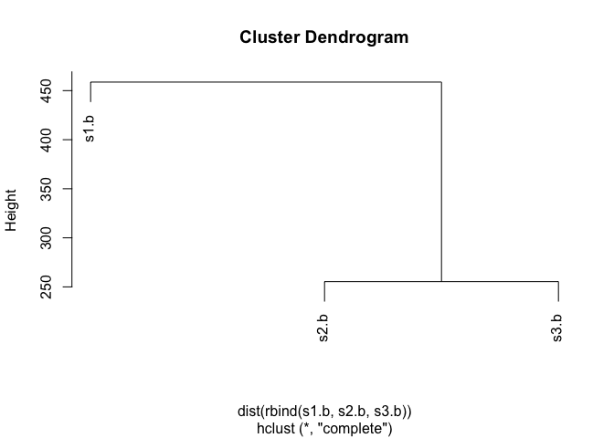

Class 6: R functions
================
Barry Grant
4/19/2019

Overview
--------

Today we will focus on **R functions** but we will start with a bit of **file reading**.

``` r
plot(1:10, type="l", col="blue")
```


``` r
read.table("test1.txt", header=TRUE, sep=",")
```

    ##   Col1 Col2 Col3
    ## 1    1    2    3
    ## 2    4    5    6
    ## 3    7    8    9
    ## 4    a    b    c

I am going to see if I can open the other example files by setting the appropriate arguments to the functions...

``` r
read.table("test2.txt", sep="$", header=TRUE)
```

    ##   Col1 Col2 Col3
    ## 1    1    2    3
    ## 2    4    5    6
    ## 3    7    8    9
    ## 4    a    b    c

``` r
read.table("test3.txt")
```

    ##   V1 V2 V3
    ## 1  1  6  a
    ## 2  2  7  b
    ## 3  3  8  c
    ## 4  4  9  d
    ## 5  5 10  e

``` r
read.csv("https://bioboot.github.io/bggn213_S19/class-material/test1.txt")
```

    ##   Col1 Col2 Col3
    ## 1    1    2    3
    ## 2    4    5    6
    ## 3    7    8    9
    ## 4    a    b    c

Our first function
------------------

Add some numbers

``` r
add <- function(x, y=1) {
  # The body
  x + y
}
```

``` r
add(4, y=5)
```

    ## [1] 9

``` r
add( c(1,3,5), 1)
```

    ## [1] 2 4 6

``` r
add( c(1,3,5) )
```

    ## [1] 2 4 6

``` r
#add( 1, 3, 5)
```

``` r
#add(x=1, y="barry")
```

``` r
add(4)
```

    ## [1] 5

our 2nd example function
------------------------

``` r
rescale <- function(x) {
   rng <-range(x)
   (x - rng[1]) / (rng[2] - rng[1])
}
```

``` r
rescale( c(1, 3, NA, 5, 10) )
```

    ## [1] NA NA NA NA NA

``` r
x <- c(1, 3, NA, 5, 10)
rng <-range(x, na.rm=TRUE)
rng
```

    ## [1]  1 10

``` r
(x - rng[1]) / (rng[2] - rng[1])
```

    ## [1] 0.0000000 0.2222222        NA 0.4444444 1.0000000

``` r
rescale2 <- function(x, na.rm=TRUE) {
   rng <-range(x, na.rm=na.rm)
   (x - rng[1]) / (rng[2] - rng[1])
}
```

``` r
rescale2( c( 1,3,NA,10) )
```

    ## [1] 0.0000000 0.2222222        NA 1.0000000

``` r
#rescale2( c(1,3,"barry",10) )
```

``` r
rescale( 1:10 )
```

    ##  [1] 0.0000000 0.1111111 0.2222222 0.3333333 0.4444444 0.5555556 0.6666667
    ##  [8] 0.7777778 0.8888889 1.0000000

Anoter example extension

``` r
rescale3 <- function(x, na.rm=TRUE, plot=FALSE) {

    rng <-range(x, na.rm=na.rm)
    print("Hello")

   answer <- (x - rng[1]) / (rng[2] - rng[1])

   
   print("is it me you are looking for?")

   if(plot) { 
      plot(answer, typ="b", lwd=4) 
     print("Dont sing please!!!")
   }
   print("I can see it in ...")
   return(answer)

}
```

``` r
rescale3( 1:10 )
```

    ## [1] "Hello"
    ## [1] "is it me you are looking for?"
    ## [1] "I can see it in ..."

    ##  [1] 0.0000000 0.1111111 0.2222222 0.3333333 0.4444444 0.5555556 0.6666667
    ##  [8] 0.7777778 0.8888889 1.0000000

``` r
rescale3( 1:10, plot=TRUE)
```

    ## [1] "Hello"
    ## [1] "is it me you are looking for?"


    ## [1] "Dont sing please!!!"
    ## [1] "I can see it in ..."

    ##  [1] 0.0000000 0.1111111 0.2222222 0.3333333 0.4444444 0.5555556 0.6666667
    ##  [8] 0.7777778 0.8888889 1.0000000

Section 1B Hands-on
===================

``` r
library(bio3d)
pdb <- read.pdb("4AKE")
```

    ##   Note: Accessing on-line PDB file

``` r
is.vector(pdb)
```

    ## [1] FALSE

``` r
is.data.frame(pdb)
```

    ## [1] FALSE

``` r
is.list(pdb)
```

    ## [1] TRUE

``` r
pdb$seqres
```

    ##     A     A     A     A     A     A     A     A     A     A     A     A 
    ## "MET" "ARG" "ILE" "ILE" "LEU" "LEU" "GLY" "ALA" "PRO" "GLY" "ALA" "GLY" 
    ##     A     A     A     A     A     A     A     A     A     A     A     A 
    ## "LYS" "GLY" "THR" "GLN" "ALA" "GLN" "PHE" "ILE" "MET" "GLU" "LYS" "TYR" 
    ##     A     A     A     A     A     A     A     A     A     A     A     A 
    ## "GLY" "ILE" "PRO" "GLN" "ILE" "SER" "THR" "GLY" "ASP" "MET" "LEU" "ARG" 
    ##     A     A     A     A     A     A     A     A     A     A     A     A 
    ## "ALA" "ALA" "VAL" "LYS" "SER" "GLY" "SER" "GLU" "LEU" "GLY" "LYS" "GLN" 
    ##     A     A     A     A     A     A     A     A     A     A     A     A 
    ## "ALA" "LYS" "ASP" "ILE" "MET" "ASP" "ALA" "GLY" "LYS" "LEU" "VAL" "THR" 
    ##     A     A     A     A     A     A     A     A     A     A     A     A 
    ## "ASP" "GLU" "LEU" "VAL" "ILE" "ALA" "LEU" "VAL" "LYS" "GLU" "ARG" "ILE" 
    ##     A     A     A     A     A     A     A     A     A     A     A     A 
    ## "ALA" "GLN" "GLU" "ASP" "CYS" "ARG" "ASN" "GLY" "PHE" "LEU" "LEU" "ASP" 
    ##     A     A     A     A     A     A     A     A     A     A     A     A 
    ## "GLY" "PHE" "PRO" "ARG" "THR" "ILE" "PRO" "GLN" "ALA" "ASP" "ALA" "MET" 
    ##     A     A     A     A     A     A     A     A     A     A     A     A 
    ## "LYS" "GLU" "ALA" "GLY" "ILE" "ASN" "VAL" "ASP" "TYR" "VAL" "LEU" "GLU" 
    ##     A     A     A     A     A     A     A     A     A     A     A     A 
    ## "PHE" "ASP" "VAL" "PRO" "ASP" "GLU" "LEU" "ILE" "VAL" "ASP" "ARG" "ILE" 
    ##     A     A     A     A     A     A     A     A     A     A     A     A 
    ## "VAL" "GLY" "ARG" "ARG" "VAL" "HIS" "ALA" "PRO" "SER" "GLY" "ARG" "VAL" 
    ##     A     A     A     A     A     A     A     A     A     A     A     A 
    ## "TYR" "HIS" "VAL" "LYS" "PHE" "ASN" "PRO" "PRO" "LYS" "VAL" "GLU" "GLY" 
    ##     A     A     A     A     A     A     A     A     A     A     A     A 
    ## "LYS" "ASP" "ASP" "VAL" "THR" "GLY" "GLU" "GLU" "LEU" "THR" "THR" "ARG" 
    ##     A     A     A     A     A     A     A     A     A     A     A     A 
    ## "LYS" "ASP" "ASP" "GLN" "GLU" "GLU" "THR" "VAL" "ARG" "LYS" "ARG" "LEU" 
    ##     A     A     A     A     A     A     A     A     A     A     A     A 
    ## "VAL" "GLU" "TYR" "HIS" "GLN" "MET" "THR" "ALA" "PRO" "LEU" "ILE" "GLY" 
    ##     A     A     A     A     A     A     A     A     A     A     A     A 
    ## "TYR" "TYR" "SER" "LYS" "GLU" "ALA" "GLU" "ALA" "GLY" "ASN" "THR" "LYS" 
    ##     A     A     A     A     A     A     A     A     A     A     A     A 
    ## "TYR" "ALA" "LYS" "VAL" "ASP" "GLY" "THR" "LYS" "PRO" "VAL" "ALA" "GLU" 
    ##     A     A     A     A     A     A     A     A     A     A     B     B 
    ## "VAL" "ARG" "ALA" "ASP" "LEU" "GLU" "LYS" "ILE" "LEU" "GLY" "MET" "ARG" 
    ##     B     B     B     B     B     B     B     B     B     B     B     B 
    ## "ILE" "ILE" "LEU" "LEU" "GLY" "ALA" "PRO" "GLY" "ALA" "GLY" "LYS" "GLY" 
    ##     B     B     B     B     B     B     B     B     B     B     B     B 
    ## "THR" "GLN" "ALA" "GLN" "PHE" "ILE" "MET" "GLU" "LYS" "TYR" "GLY" "ILE" 
    ##     B     B     B     B     B     B     B     B     B     B     B     B 
    ## "PRO" "GLN" "ILE" "SER" "THR" "GLY" "ASP" "MET" "LEU" "ARG" "ALA" "ALA" 
    ##     B     B     B     B     B     B     B     B     B     B     B     B 
    ## "VAL" "LYS" "SER" "GLY" "SER" "GLU" "LEU" "GLY" "LYS" "GLN" "ALA" "LYS" 
    ##     B     B     B     B     B     B     B     B     B     B     B     B 
    ## "ASP" "ILE" "MET" "ASP" "ALA" "GLY" "LYS" "LEU" "VAL" "THR" "ASP" "GLU" 
    ##     B     B     B     B     B     B     B     B     B     B     B     B 
    ## "LEU" "VAL" "ILE" "ALA" "LEU" "VAL" "LYS" "GLU" "ARG" "ILE" "ALA" "GLN" 
    ##     B     B     B     B     B     B     B     B     B     B     B     B 
    ## "GLU" "ASP" "CYS" "ARG" "ASN" "GLY" "PHE" "LEU" "LEU" "ASP" "GLY" "PHE" 
    ##     B     B     B     B     B     B     B     B     B     B     B     B 
    ## "PRO" "ARG" "THR" "ILE" "PRO" "GLN" "ALA" "ASP" "ALA" "MET" "LYS" "GLU" 
    ##     B     B     B     B     B     B     B     B     B     B     B     B 
    ## "ALA" "GLY" "ILE" "ASN" "VAL" "ASP" "TYR" "VAL" "LEU" "GLU" "PHE" "ASP" 
    ##     B     B     B     B     B     B     B     B     B     B     B     B 
    ## "VAL" "PRO" "ASP" "GLU" "LEU" "ILE" "VAL" "ASP" "ARG" "ILE" "VAL" "GLY" 
    ##     B     B     B     B     B     B     B     B     B     B     B     B 
    ## "ARG" "ARG" "VAL" "HIS" "ALA" "PRO" "SER" "GLY" "ARG" "VAL" "TYR" "HIS" 
    ##     B     B     B     B     B     B     B     B     B     B     B     B 
    ## "VAL" "LYS" "PHE" "ASN" "PRO" "PRO" "LYS" "VAL" "GLU" "GLY" "LYS" "ASP" 
    ##     B     B     B     B     B     B     B     B     B     B     B     B 
    ## "ASP" "VAL" "THR" "GLY" "GLU" "GLU" "LEU" "THR" "THR" "ARG" "LYS" "ASP" 
    ##     B     B     B     B     B     B     B     B     B     B     B     B 
    ## "ASP" "GLN" "GLU" "GLU" "THR" "VAL" "ARG" "LYS" "ARG" "LEU" "VAL" "GLU" 
    ##     B     B     B     B     B     B     B     B     B     B     B     B 
    ## "TYR" "HIS" "GLN" "MET" "THR" "ALA" "PRO" "LEU" "ILE" "GLY" "TYR" "TYR" 
    ##     B     B     B     B     B     B     B     B     B     B     B     B 
    ## "SER" "LYS" "GLU" "ALA" "GLU" "ALA" "GLY" "ASN" "THR" "LYS" "TYR" "ALA" 
    ##     B     B     B     B     B     B     B     B     B     B     B     B 
    ## "LYS" "VAL" "ASP" "GLY" "THR" "LYS" "PRO" "VAL" "ALA" "GLU" "VAL" "ARG" 
    ##     B     B     B     B     B     B     B     B 
    ## "ALA" "ASP" "LEU" "GLU" "LYS" "ILE" "LEU" "GLY"

``` r
s1 <- read.pdb("4AKE")
```

    ##   Note: Accessing on-line PDB file

    ## Warning in get.pdb(file, path = tempdir(), verbose = FALSE): /var/folders/
    ## xf/qznxnpf91vb1wm4xwgnbt0xr0000gn/T//RtmplkLm2k/4AKE.pdb exists. Skipping
    ## download

``` r
s1
```

    ## 
    ##  Call:  read.pdb(file = "4AKE")
    ## 
    ##    Total Models#: 1
    ##      Total Atoms#: 3459,  XYZs#: 10377  Chains#: 2  (values: A B)
    ## 
    ##      Protein Atoms#: 3312  (residues/Calpha atoms#: 428)
    ##      Nucleic acid Atoms#: 0  (residues/phosphate atoms#: 0)
    ## 
    ##      Non-protein/nucleic Atoms#: 147  (residues: 147)
    ##      Non-protein/nucleic resid values: [ HOH (147) ]
    ## 
    ##    Protein sequence:
    ##       MRIILLGAPGAGKGTQAQFIMEKYGIPQISTGDMLRAAVKSGSELGKQAKDIMDAGKLVT
    ##       DELVIALVKERIAQEDCRNGFLLDGFPRTIPQADAMKEAGINVDYVLEFDVPDELIVDRI
    ##       VGRRVHAPSGRVYHVKFNPPKVEGKDDVTGEELTTRKDDQEETVRKRLVEYHQMTAPLIG
    ##       YYSKEAEAGNTKYAKVDGTKPVAEVRADLEKILGMRIILLGAPGA...<cut>...KILG
    ## 
    ## + attr: atom, xyz, seqres, helix, sheet,
    ##         calpha, remark, call

``` r
s1.chainA <- trim.pdb(s1, chain="A", elety="CA")
s1.chainA
```

    ## 
    ##  Call:  trim.pdb(pdb = s1, chain = "A", elety = "CA")
    ## 
    ##    Total Models#: 1
    ##      Total Atoms#: 214,  XYZs#: 642  Chains#: 1  (values: A)
    ## 
    ##      Protein Atoms#: 214  (residues/Calpha atoms#: 214)
    ##      Nucleic acid Atoms#: 0  (residues/phosphate atoms#: 0)
    ## 
    ##      Non-protein/nucleic Atoms#: 0  (residues: 0)
    ##      Non-protein/nucleic resid values: [ none ]
    ## 
    ##    Protein sequence:
    ##       MRIILLGAPGAGKGTQAQFIMEKYGIPQISTGDMLRAAVKSGSELGKQAKDIMDAGKLVT
    ##       DELVIALVKERIAQEDCRNGFLLDGFPRTIPQADAMKEAGINVDYVLEFDVPDELIVDRI
    ##       VGRRVHAPSGRVYHVKFNPPKVEGKDDVTGEELTTRKDDQEETVRKRLVEYHQMTAPLIG
    ##       YYSKEAEAGNTKYAKVDGTKPVAEVRADLEKILG
    ## 
    ## + attr: atom, helix, sheet, seqres, xyz,
    ##         calpha, call

``` r
s1.b <- s1.chainA$atom$b
plotb3(s1.b, sse=s1.chainA, typ="l", ylab="Bfactor")
```


``` r
plotb3(s1.b, typ="l", ylab="Bfactor")
```


``` r
s1 <- read.pdb("4AKE")  # kinase with drug
```

    ##   Note: Accessing on-line PDB file

    ## Warning in get.pdb(file, path = tempdir(), verbose = FALSE): /var/folders/
    ## xf/qznxnpf91vb1wm4xwgnbt0xr0000gn/T//RtmplkLm2k/4AKE.pdb exists. Skipping
    ## download

``` r
s2 <- read.pdb("1AKE")  # kinase no drug
```

    ##   Note: Accessing on-line PDB file
    ##    PDB has ALT records, taking A only, rm.alt=TRUE

``` r
s3 <- read.pdb("1E4Y")  # kinase with drug
```

    ##   Note: Accessing on-line PDB file

``` r
s1.chainA <- trim.pdb(s1, chain="A", elety="CA")
s2.chainA <- trim.pdb(s2, chain="A", elety="CA")
s3.chainA <- trim.pdb(s3, chain="A", elety="CA")
s1.b <- s1.chainA$atom$b
s2.b <- s2.chainA$atom$b
s3.b <- s3.chainA$atom$b
plotb3(s1.b, sse=s1.chainA, typ="l", ylab="Bfactor")
```


``` r
plotb3(s2.b, sse=s2.chainA, typ="l", ylab="Bfactor")
```


``` r
plotb3(s3.b, sse=s3.chainA, typ="l", ylab="Bfactor")
```


``` r
rbind( 1:10, 1:10, 1:10) 
```

    ##      [,1] [,2] [,3] [,4] [,5] [,6] [,7] [,8] [,9] [,10]
    ## [1,]    1    2    3    4    5    6    7    8    9    10
    ## [2,]    1    2    3    4    5    6    7    8    9    10
    ## [3,]    1    2    3    4    5    6    7    8    9    10

``` r
hc <- hclust( dist( rbind(s1.b, s2.b, s3.b) ) )
plot(hc)
```



``` r
# Dont ever start like this
makeplot <- function(x) {
  s1 <- read.pdb(x)  # kinase with drug

}
```
