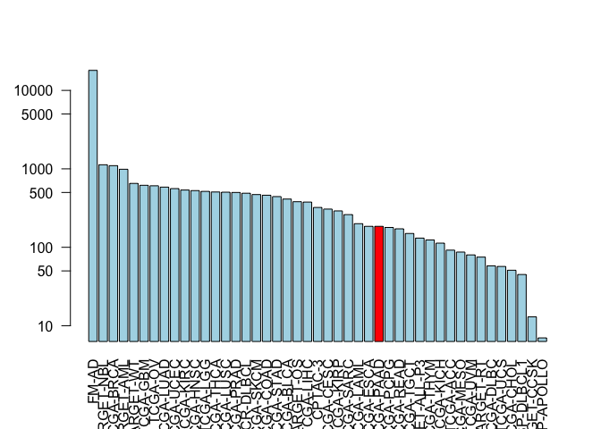

Class 18: Cancer Genomics
================

Accessing the Genomic Data Commons
----------------------------------

We need the bioconductor package **GenomicDataCommons**

``` r
BiocManager::install("GenomicDataCommons")
```

Let's use this package to ping the database.

``` r
library(GenomicDataCommons)
```

    ## Loading required package: magrittr

    ## 
    ## Attaching package: 'GenomicDataCommons'

    ## The following object is masked from 'package:stats':
    ## 
    ##     filter

``` r
status()
```

    ## $commit
    ## [1] "e588f035feefee17f562b3a1bc2816c49a2b2b19"
    ## 
    ## $data_release
    ## [1] "Data Release 16.0 - March 26, 2019"
    ## 
    ## $status
    ## [1] "OK"
    ## 
    ## $tag
    ## [1] "1.20.0"
    ## 
    ## $version
    ## [1] 1

``` r
library(TCGAbiolinks)
```

    ## Warning: package 'TCGAbiolinks' was built under R version 3.5.3

Query the GDC

``` r
cases_by_project <- cases() %>%
  facet("project.project_id") %>%
  aggregations()
```

``` r
x <- cases_by_project$project.project_id
head(x)
```

    ##          key doc_count
    ## 1      FM-AD     18004
    ## 2 TARGET-NBL      1127
    ## 3  TCGA-BRCA      1098
    ## 4 TARGET-AML       988
    ## 5  TARGET-WT       652
    ## 6   TCGA-GBM       617

``` r
colvec <- rep("lightblue", nrow(x))

colvec[ x$key == "TCGA-PAAD" ] <- "red"

barplot(x$doc_count, names.arg = x$key, las=2, log="y", col=colvec)
```



Section 2.
==========

Step 1: Identify sequence regions that contain all 9-mer peptides that are only found in the tumor - What are the tumor specific amino-acids? - What peptides include these amino acids?

``` r
library(bio3d)

seqs <- read.fasta("lecture18_sequences.fa")
#aln <- seqaln(seqs)
#aln
```

``` r
attributes(seqs)
```

    ## $names
    ## [1] "id"   "ali"  "call"
    ## 
    ## $class
    ## [1] "fasta"

``` r
seqs$ali[,41]
```

    ##     P53_wt P53_mutant 
    ##        "D"        "L"

``` r
start.ind <- 41 - 8
end.ind <- 41 + 8

seqs$ali[, start.ind:end.ind ]
```

    ##            [,1] [,2] [,3] [,4] [,5] [,6] [,7] [,8] [,9] [,10] [,11] [,12]
    ## P53_wt     "S"  "P"  "L"  "P"  "S"  "Q"  "A"  "M"  "D"  "D"   "L"   "M"  
    ## P53_mutant "S"  "P"  "L"  "P"  "S"  "Q"  "A"  "M"  "L"  "D"   "L"   "M"  
    ##            [,13] [,14] [,15] [,16] [,17]
    ## P53_wt     "L"   "S"   "P"   "D"   "D"  
    ## P53_mutant "L"   "S"   "P"   "D"   "D"

Find the sites (i.e. amino acids that are different)

``` r
ide <- conserv(seqs, method = "identity")
mismatch.inds <- which(ide < 1)
```

``` r
gaps <- gap.inspect(seqs)
gap.inds <- gaps$t.inds
```

Find the positions in mismath.inds that are NOT in gap.inds

``` r
tumor.sites <- mismatch.inds[!mismatch.inds %in% gap.inds]
```

``` r
#seqs$ali[,tumor.sites]
ids <- paste( seqs$ali[1,tumor.sites], 
       tumor.sites,
       seqs$ali[2,tumor.sites], sep="")
ids
```

    ## [1] "D41L"  "R65W"  "R213V" "D259V"

``` r
start.ind <- tumor.sites - 8
end.ind <- tumor.sites + 8

tumor <- NULL
for(i in 1:length(start.ind)) {
  tumor <- seqbind(tumor, 
                   seqs$ali[2,start.ind[i]: end.ind[i]])
}

write.fasta(ids=ids, ali=tumor, file="subsequences.fa")
```
